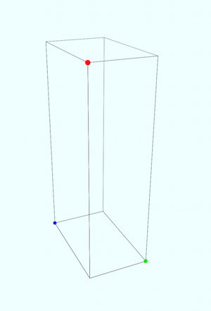
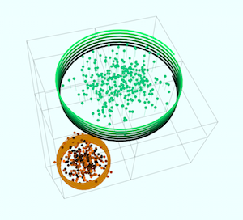

## dependence
* [three.js](http://threejs.org)

## usage
```
<script src="path/to/threejs/three.min.js"></script>
<script src="path/to/threejs/addons/CanvasRenderer.js"></script>
<script src="path/to/threejs/addons/Projector.js"></script>
<script src="path/to/threejs/addons/OrbitControls.js"></script>
<script src="path/to/ScatterPlot3D.js"></script>
```

```
const datam = [{
	type: 0,
	data: [{
			x: 0,
			y: 0,
			z: 1,
			style: '#f00'
		},
		{
			x: 0.3,
			y: 0,
			z: 0,
			style: '#0f0'
		},
		{
			x: 0,
			y: 0.5,
			z: 0,
			style: '#00f'
		}
	]
}];
ScatterPlot3D(document.getElementById('container'), datam);
```

## result





## reference
* [3D Scatter Plot Using three.js](http://bl.ocks.org/phil-pedruco/9852362)
